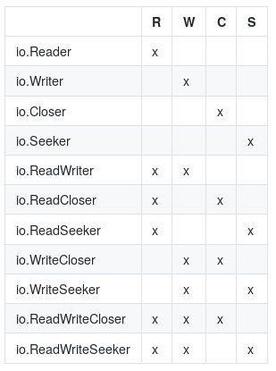
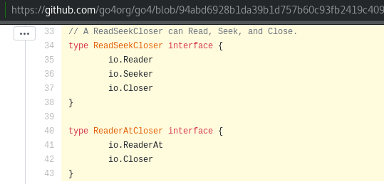
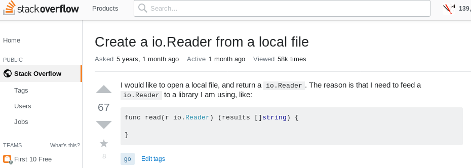

# Beautiful IO

> A tour through standard library pkg/io and various implementations of its interfaces.

Golab 2019, 2019–10–21, Florence
[Martin Czygan](mailto:martin.czygan@gmail.com)

<!-- Die Brautleute; short summaries at the beginning of the sections -->

----

# About me

SWE [@ubleipzig](https://ub.uni-leipzig.de) working mostly with Python and Go.

Taming data – open source – writing.

> [Explore IO](https://github.com/miku/exploreio) workshop at Golab 2017.

----

# Background

* Go Proverbs (2015)

> The bigger the interface, the weaker the abstraction.

Prominent examples are `io.Reader` and `io.Writer`.

----

# The IO package

* contains basic, widely used interfaces (within and outside standard library)
* utility functions

----

# Why beautiful?

> La bellezza è negli occhi di chi guarda

* small, versatile interfaces
* composable

----

# Praise and love

> This article aims to convince you to use io.Reader in your own code wherever
> you can. -- [@matryer](https://twitter.com/matryer)

> "Crossing Streams: a love letter to Go io.Reader" -- [@jmoiron](https://twitter.com/jmoiron)

> Which brings me to io.Reader, easily my favourite Go interface. --
> [@davecheney](https://twitter.com/davecheney)

----

# What's in pkg/io?

<!--
$ go doc io | grep ^type | wc -l
25
-->

* 25 types
* 21/25 are interfaces
* 12 functions, 3 constants, 6 errors

The concrete types are: `LimitedReader`, `PipeReader`, `PipeWriter`,
  `SectionReader`; functions: `Copy`, `CopyN`, `CopyBuffer`, `Pipe`,
  `ReadAtLeast`, `ReadFull`, `WriteString`, `LimitReader`, `MultiReader`,
  `TeeReader`, `NewSectionReader`, `MultiWriter`

----

# A few Interfaces




----

# Missing interfaces

You might find some missing pieces elsewhere.



----

# How many readers, writers are there?

```shell
$ guru -json implements /usr/local/go/src/io/io.go:#3309
```

I counted over 280 implementations of io.Reader and X of io.Writer.

----

# What is a Reader?

```go
type Reader interface {
        Read(p []byte) (n int, err error)
}
```

The reader implementation will populate a given byte slice.

* at most `len(p)` bytes are read
* to signal the end of a stream, return `io.EOF`

There is some flexibility around the end of a stream.

> Callers should always process the n > 0 bytes returned before considering the
error err. Doing so correctly handles I/O errors that happen after reading
some bytes and also both of the allowed EOF behaviors.

----

# Notes 

```go
type Reader interface {
        Read(p []byte) (n int, err error)
}
```

* The byte slice is under the control of the caller.

> Implementations must not retain p.

This hints at the streaming nature of this interface.

----

# Implementations

* files
* network connections
* HTTP response bodies
* standard input and output
* compression
* hashing
* encoding
* formatting
* ...

Many uses in testing as well.

----

# Structural typing

* conversions are not required, a file implements `Read` and hence *is* a
  *io.Reader*



----

# Streams

As layed out in the *love letter*, the use of `ioutil.ReadAll` is debatable.
It's in the standard library and useful, but not always necessary.

```go
b, err := ioutil.ReadAll(r)
...
```

----

# Streams

* you may lose the advantage to use the `Reader` in other places
* you may consume more memory

> Streams can trivially produce infinite output while using barely any memory at
> all - imagine an implementation behaving like /dev/zero or /dev/urandom.

* Memory control is an important advantage.

----

# Follow the stream

Instead of writing:

```
b, _ := ioutil.ReadAll(resp.Body) // Pressure on memory.
fmt.Println(string(b))
```

You can just connect streams:

```
_, _ = io.Copy(os.Stdout, resp.Body)
```

----

